# This repository immplemets following design patterns in C++ (Referred from : https://refactoring.guru/)

## Creational
### 1. Factory Pattern
 
Factory Method is a creational design pattern that provides an interface for creating objects in a superclass, but allows subclasses to alter the type of objects that will be created.

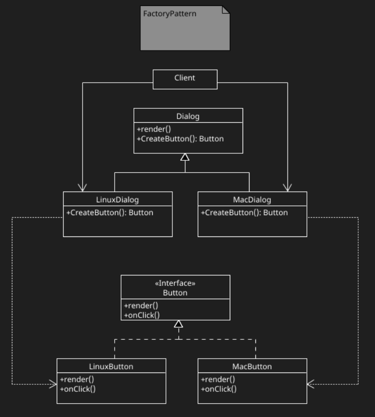

### 2. Abstract Factory
 
Abstract Factory is a creational design pattern that lets you produce families of related objects without specifying their concrete classes.

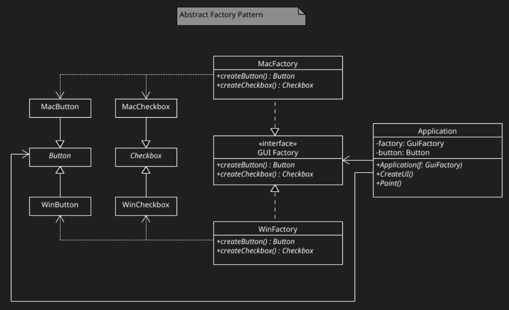

### 3. Builder
 
Builder is a creational design pattern that lets you construct complex objects step by step. The pattern allows you to produce different types and representations of an object using the same construction code.

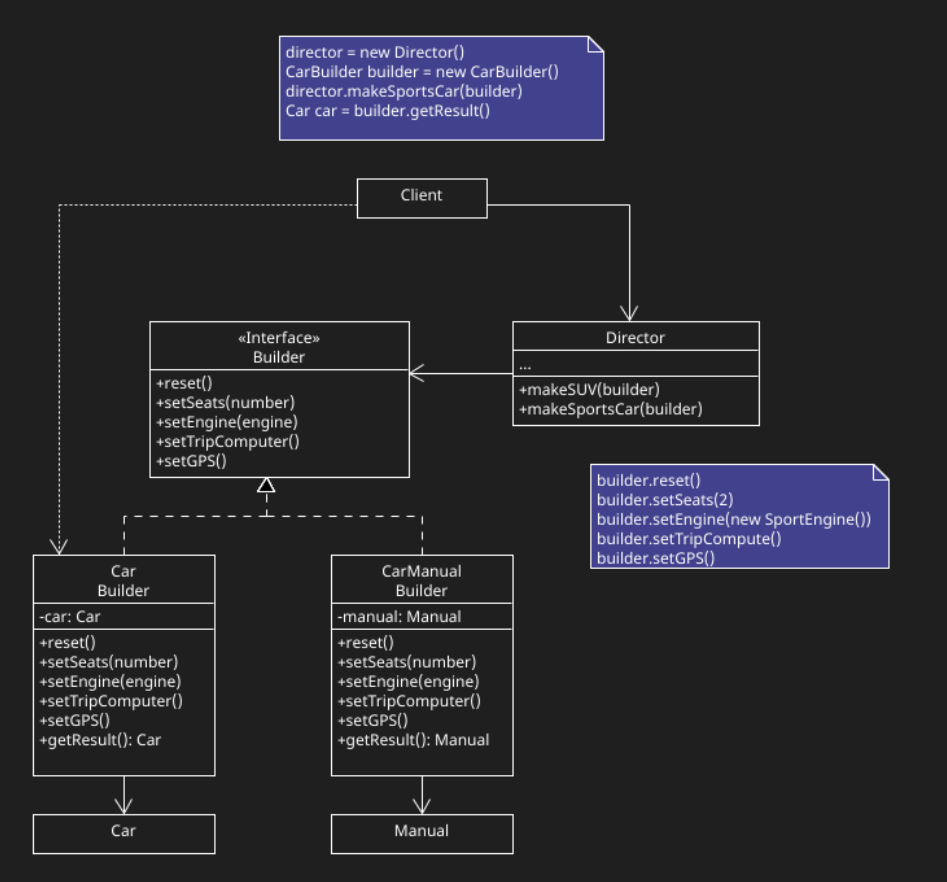

### 4. Prototype
 
Prototype is a creational design pattern that lets you copy existing objects without making your code dependent on their classes.

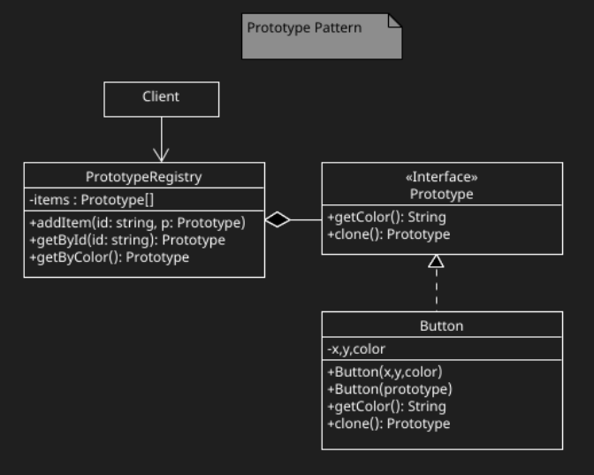

## Structural
### 1. Adaptor
 
Adapter is a structural design pattern that allows objects with incompatible interfaces to collaborate.

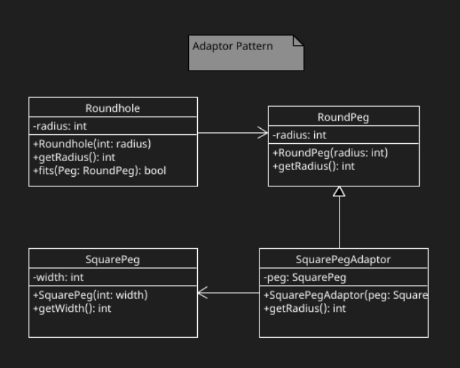

### 2. Bridge
 
Bridge is a structural design pattern that lets you split a large class or a set of closely related classes into two separate hierarchies—abstraction and implementation—which can be developed independently of each other.

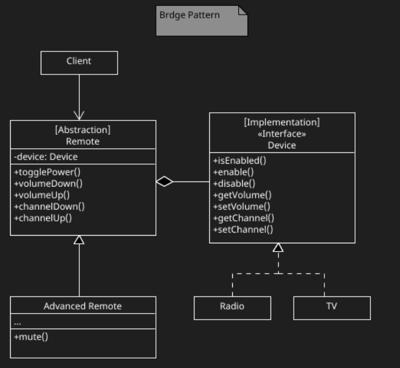

### 3. Composite
 
Composite is a structural design pattern that lets you compose objects into tree structures and then work with these structures as if they were individual objects.

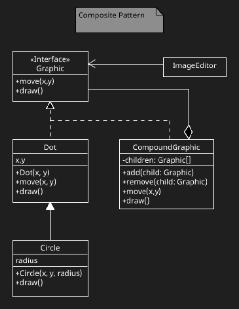

### 4. Decorator
 
Decorator is a structural design pattern that lets you attach new behaviors to objects by placing these objects inside special wrapper objects that contain the behaviors.
### 
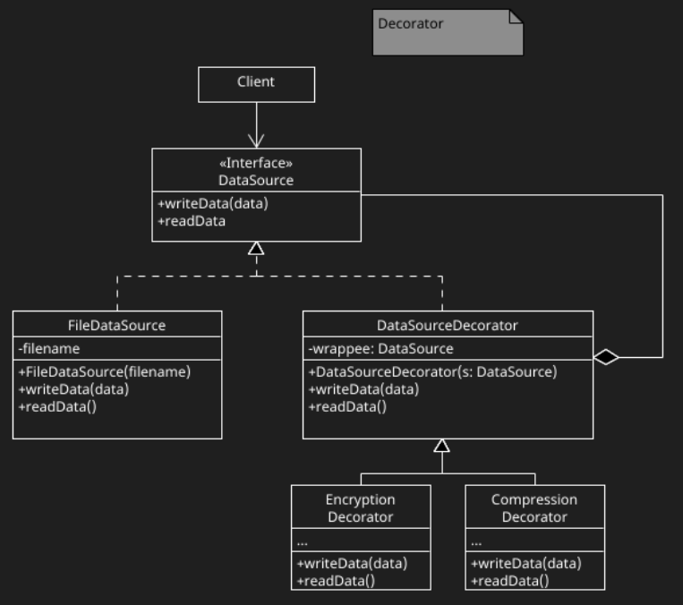

### 5. Facade
 
Facade is a structural design pattern that provides a simplified interface to a library, a framework, or any other complex set of classes.

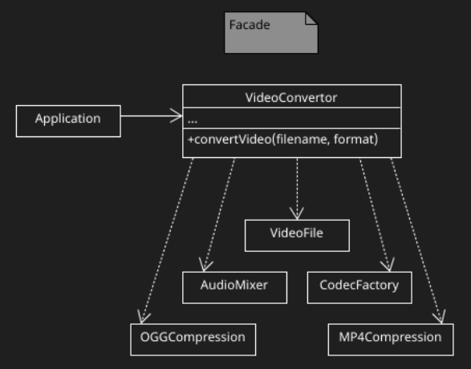

### 6. Flyweight
 
Flyweight is a structural design pattern that lets you fit more objects into the available amount of RAM by sharing common parts of state between multiple objects instead of keeping all of the data in each object.

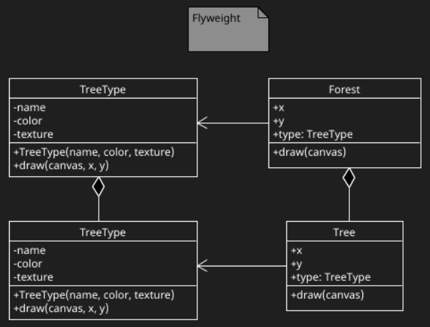

### 7. Proxy
 
Proxy is a structural design pattern that lets you provide a substitute or placeholder for another object. A proxy controls access to the original object, allowing you to perform something either before or after the request gets through to the original object.

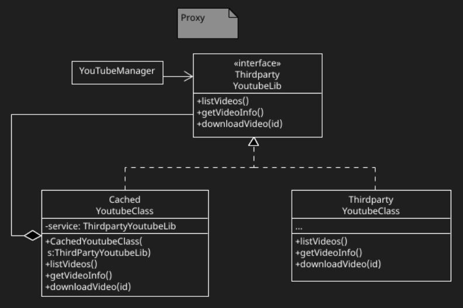

## Behavioural
### 1. ChainOfResponsibility
 
Chain of Responsibility is a behavioral design pattern that lets you pass requests along a chain of handlers. Upon receiving a request, each handler decides either to process the request or to pass it to the next handler in the chain.

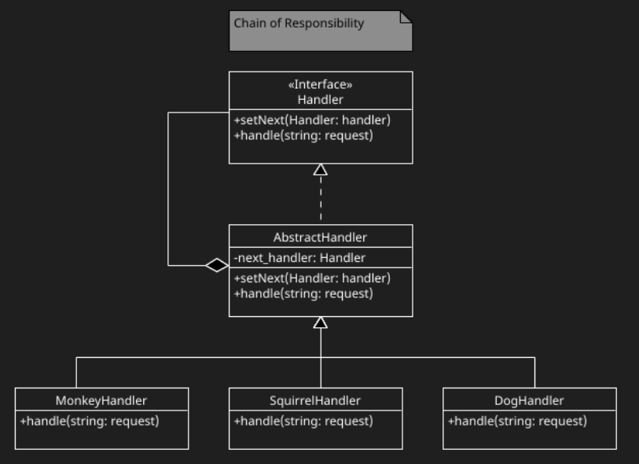

### 2. Command
 
Command is a behavioral design pattern that turns a request into a stand-alone object that contains all information about the request. This transformation lets you pass requests as a method arguments, delay or queue a request’s execution, and support undoable operations.

### 3. Iterator
 
Iterator is a behavioral design pattern that lets you traverse elements of a collection without exposing its underlying representation (list, stack, tree, etc.).

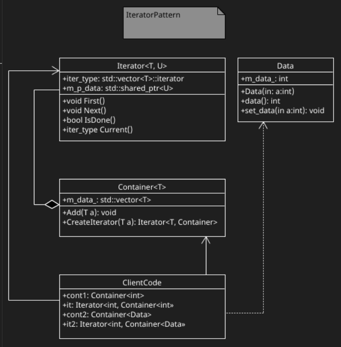

### 4. Mediator
 
Mediator is a behavioral design pattern that lets you reduce chaotic dependencies between objects. The pattern restricts direct communications between the objects and forces them to collaborate only via a mediator object.

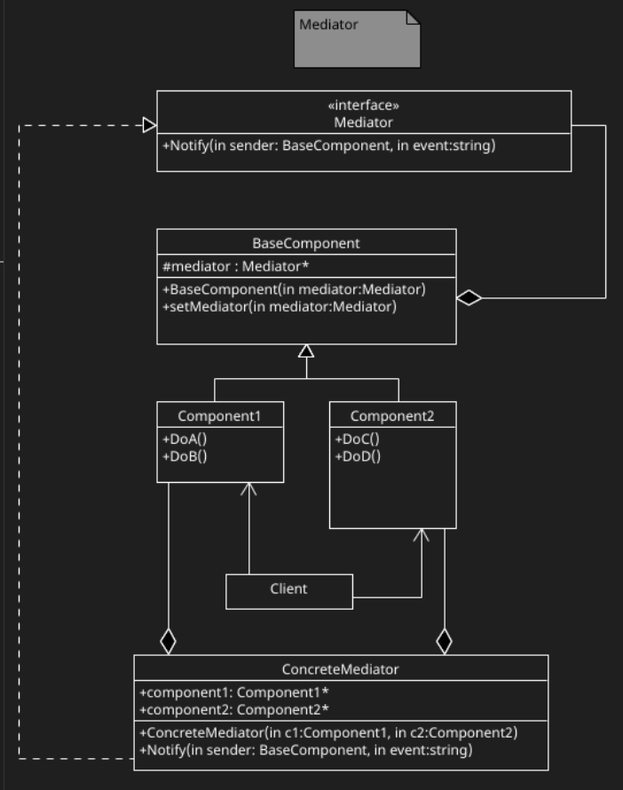

### 5. Momento
 
Memento is a behavioral design pattern that lets you save and restore the previous state of an object without revealing the details of its implementation.

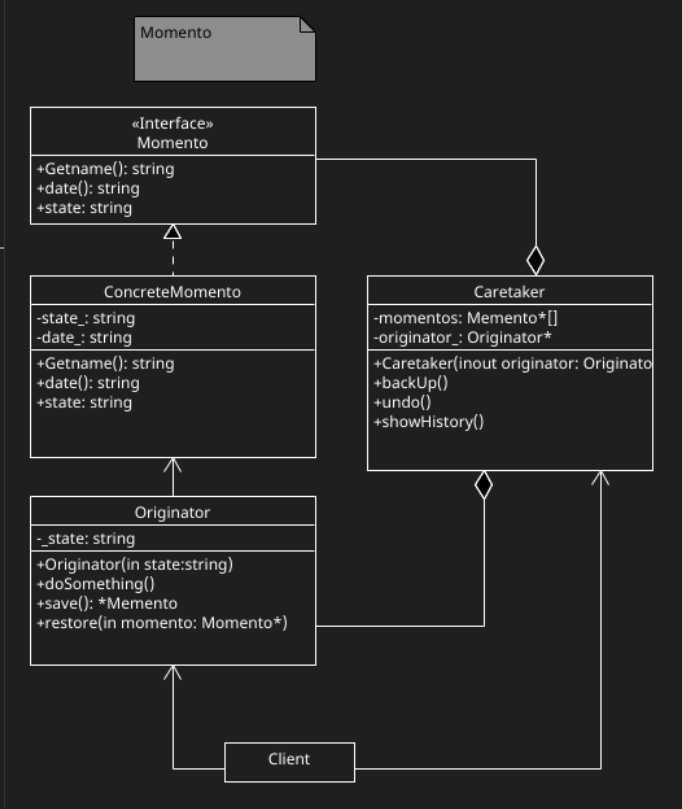

### 6. Observer
 
Observer is a behavioral design pattern that lets you define a subscription mechanism to notify multiple objects about any events that happen to the object they’re observing.

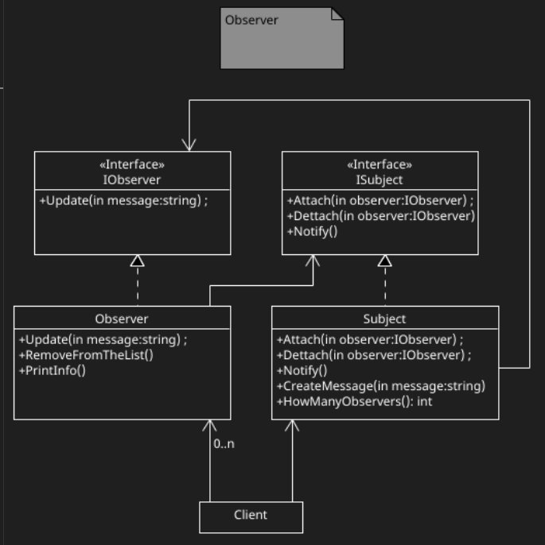

### 7. State
 
State is a behavioral design pattern that lets an object alter its behavior when its internal state changes. It appears as if the object changed its class.

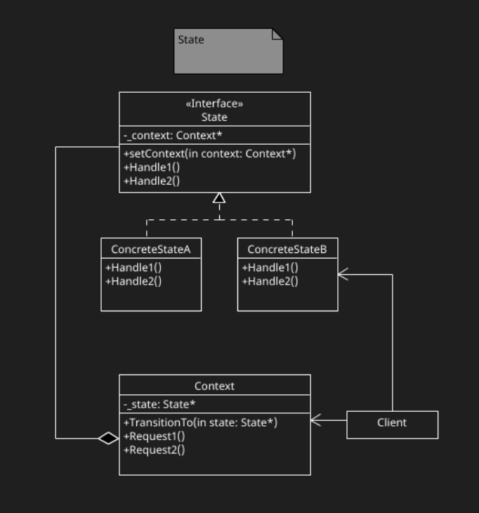

### 8. Strategy
 
Strategy is a behavioral design pattern that lets you define a family of algorithms, put each of them into a separate class, and make their objects interchangeable.

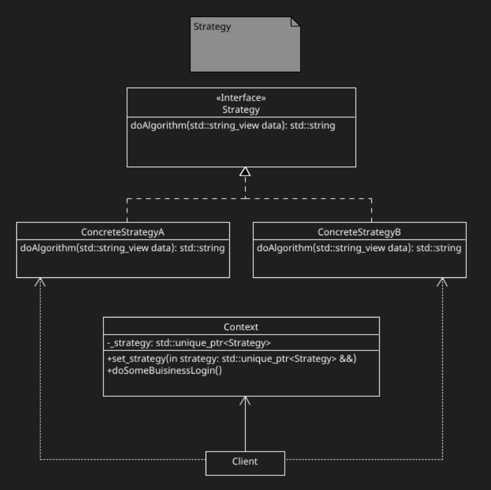

### 9. Template
 
Template Method is a behavioral design pattern that defines the skeleton of an algorithm in the superclass but lets subclasses override specific steps of the algorithm without changing its structure.

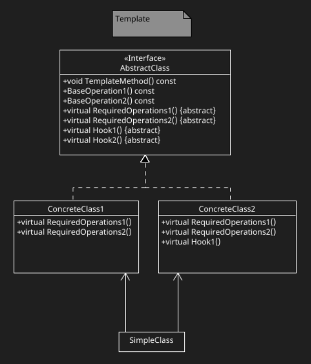

### 10. Visitor
 
Visitor is a behavioral design pattern that lets you separate algorithms from the objects on which they operate.

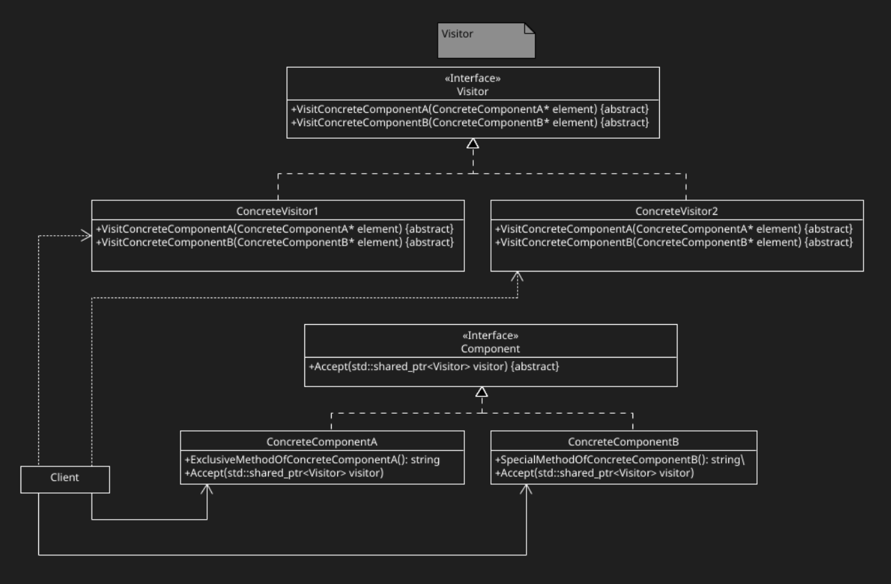